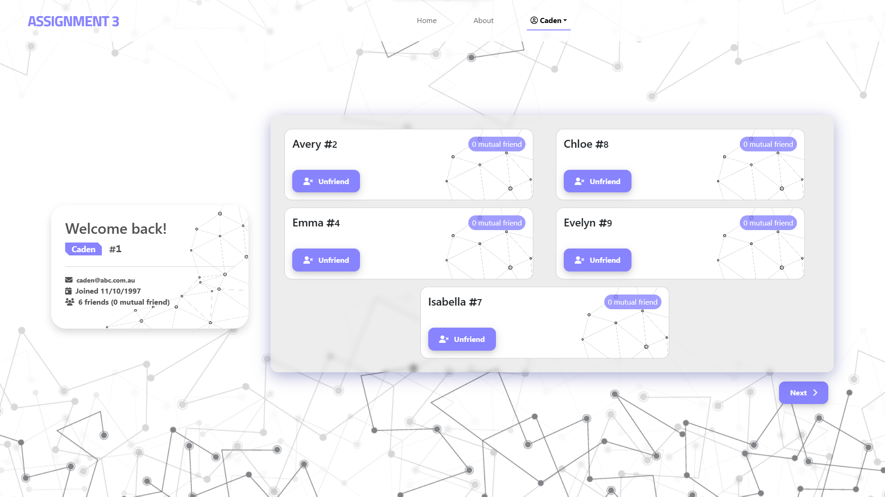

<h1>My Friends Systems</h1>

  


<br>

## Overview

**My Friends System** is a small application to maintain your friendlist. Or, just a simplified social network.

#### Core Functionalities
- Maintain friendlist
- Provide counter for mutual friends
- PHP Session: login/register, log out

<br>



## Installation

- Clone this repo
  ```
  git clone https://github.com/Ryan5358/my-friend-system.git
  ```
- This software requires a web server, e.g, `Apache` and a `MySQL` server for relational database management. It is recommended to use this All-In-One solution, [`XAMPP`](https://www.apachefriends.org/download.html).
- Before starting the servers, configure the database credentials in `settings.php`.

## Getting started

You can either: 
- put the whole repo under xampp/htdocs 
- or [change the default htdocs path](https://bobcares.com/blog/xampp-change-htdocs-location-windows/#:~:text=We%20can%20do%20this%20by,them%20to%20the%20new%20location.)

Once ready, just start the Web server and the MySQL server, and the application can be used.

## Author

| Name                 | Student ID | Email                         |
| :------------------- | ---------- | :---------------------------: |
| Ryan Vu              | 103511424  | 103511424@student.swin.edu.au |

## Licence

This software/application is provided under `MIT Licence`.
